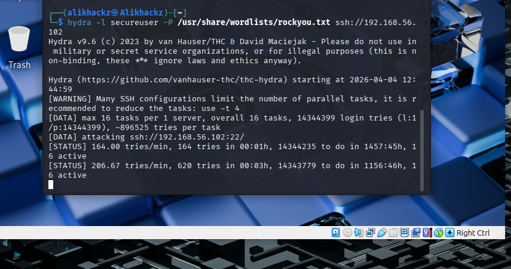

## Attack — Brute Force (SSH)

### Objective

The purpose of this attack is to simulate a brute-force attempt against the SSH service in order to gain unauthorized access.

This demonstrates how attackers attempt to compromise accounts using automated password guessing.

---

### Tool Used

- Hydra (Network login brute-force tool)

---

### Target

- Service: SSH  
- User: secureuser  
- Protocol: TCP (port 22)  

---

### Step 1 — Execute Brute Force Attack

From the attacker system (Kali Linux), run:

hydra -l secureuser -P rockyou.txt ssh://<target-ip>  

---

### Step 2 — Observe Attack Behavior

During execution, Hydra will:

- Attempt multiple password combinations  
- Rapidly send authentication requests  
- Continue until a valid credential is found or attempts are exhausted  

Example output:

---

### Step 3 — Analyze Impact on Target

On the target system, monitor logs:

sudo tail -f /var/log/auth.log  

Observed behavior:

- Repeated failed login attempts  
- High-frequency authentication requests  
- Single source IP performing multiple attempts  

Example log evidence:

---

### Step 4 — Identify Indicators of Compromise

Key indicators include:

- Multiple "Failed password" entries  
- Repeated attempts from a single IP address  
- Short time intervals between attempts  

---

### Attack Summary

Attack Type        Method
------------------  ----------------------------
Brute force        Password guessing via Hydra
Target service     SSH (port 22)
Impact             Unauthorized access attempt

---

### Security Risk

Without protection:

- Unlimited login attempts are allowed  
- Weak credentials can be compromised  
- Attackers can gain system access  

---

### Outcome

This attack demonstrates how automated tools can exploit exposed services such as SSH.

It highlights the importance of:

- Monitoring authentication logs  
- Detecting abnormal login patterns  
- Implementing controls such as Fail2Ban to mitigate brute-force attacks
