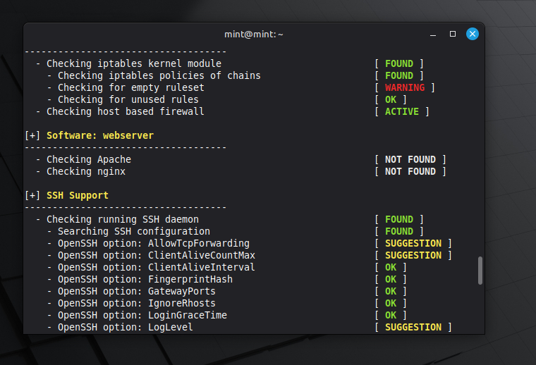
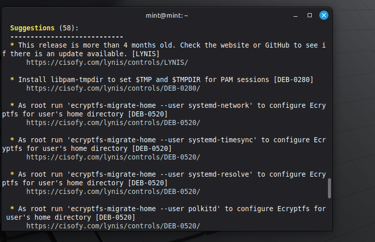

## Audit — System Security Assessment (Lynis)

### Objective

The purpose of this phase is to perform a security audit of the Linux system using an automated auditing tool.

This provides visibility into system weaknesses, misconfigurations, and hardening opportunities before and after implementing defenses.

---

### Tool Used

- Lynis (Open-source security auditing tool for Unix/Linux systems)

---

### Step 1 — Install Lynis

sudo apt update 
sudo apt install lynis -y 

Verify installation:

lynis --version 

---

### Step 2 — Run System Audit

Execute a full system audit:

sudo lynis audit system 

---

### Step 3 — Review Audit Output

During execution, Lynis evaluates:

- Authentication mechanisms 
- SSH configuration 
- File permissions 
- Firewall status 
- Installed packages 
- System hardening level 

Example audit execution:

---

### Step 4 — Identify Key Findings

Focus on:

- Warnings 
- Suggestions 
- Hardening index score 

Example results:

[+] Security Audit Results 
Warnings:        X 
Suggestions:     X 
Hardening index: XX [########      ] 

---

### Step 5 — Locate Detailed Report

cat /var/log/lynis-report.dat 

Optional:

less /var/log/lynis.log 

Example report output:

---

### Step 6 — Extract Relevant Findings

Common findings may include:

- SSH root login enabled 
- Weak password policies 
- Missing firewall rules 
- Unnecessary services running 

---

### Step 7 — Apply Fixes (Optional)

Disable root login:

sudo nano /etc/ssh/sshd_config 

Set:

PermitRootLogin no 

Restart SSH:

sudo systemctl restart ssh 

---

### Validation

Audit phase is successful when:

- Lynis scan completes without errors 
- Hardening index is recorded 
- Key warnings and suggestions are identified 
- Report file is accessible 

---

### Key Takeaways

- Identified baseline security posture 
- Highlighted system weaknesses before hardening 
- Provided actionable recommendations for improvement 

---

### Outcome

This phase establishes a measurable security baseline and supports comparison after implementing controls.
