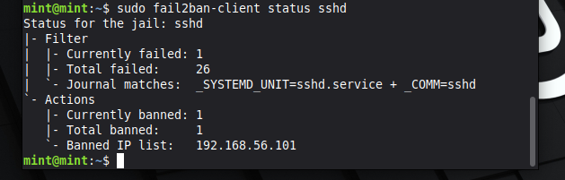

## Fail2Ban — Automated Intrusion Prevention

### Objective

The purpose of this control is to detect and automatically block malicious login attempts targeting the SSH service.

Fail2Ban enhances system security by monitoring authentication logs and enforcing temporary bans on IP addresses that exceed defined failure thresholds.

---

### Installation

Install Fail2Ban:

sudo apt update  
sudo apt install fail2ban -y  

---

### Configuration

Create or modify the local configuration file:

sudo nano /etc/fail2ban/jail.local  

Add the following configuration:

[sshd]  
enabled = true  
maxretry = 3  
bantime = 600  

---

### Configuration Details

Setting        Description
-------------  -----------------------------------------
enabled        Enables monitoring for SSH service
maxretry       Number of failed login attempts before ban
bantime        Duration (in seconds) that an IP is blocked

---

### Service Management

Restart Fail2Ban to apply changes:

sudo systemctl restart fail2ban  

Verify service status:

sudo systemctl status fail2ban  

---

### Monitoring and Verification

Check SSH jail status:

sudo fail2ban-client status sshd  

Expected output includes:

- Active jail status  
- Number of failed attempts  
- List of banned IP addresses  

Example output:

---

### Log Monitoring

Fail2Ban monitors authentication logs:

/var/log/auth.log  

Relevant indicators include:

- Failed password attempts  
- IP ban events triggered by Fail2Ban  

---

### Security Impact

Before implementation:

- Unlimited SSH login attempts allowed  
- No automated protection against brute-force attacks  

After implementation:

- Repeated failed login attempts trigger automatic IP bans  
- Brute-force attacks are mitigated through rate limiting and blocking  

---

### Outcome

Fail2Ban provides automated intrusion prevention by:

- Detecting repeated authentication failures  
- Blocking malicious IP addresses  
- Reducing exposure to brute-force attacks  

This control significantly improves the security of externally accessible services such as SSH.
