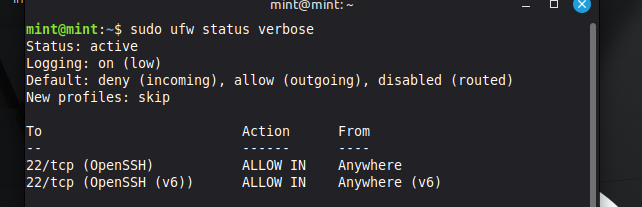

## Firewall — Network Access Control (UFW)

### Objective

The purpose of this control is to restrict network access to the system by allowing only required services and blocking all other incoming connections.

A host-based firewall reduces the attack surface and limits exposure of services to unauthorized access.

---

### Installation

Install UFW (Uncomplicated Firewall):

sudo apt update  
sudo apt install ufw -y  

---

### Configuration

Allow SSH access:

sudo ufw allow OpenSSH  

Enable the firewall:

sudo ufw enable  

---

### Verification

Check firewall status:

sudo ufw status verbose  

Expected output:

- Firewall is active  
- SSH is allowed  
- All other inbound connections are denied by default  

Example output:

---

### Default Behavior

UFW enforces the following behavior:

- Deny all incoming traffic by default  
- Allow explicitly permitted services (e.g., SSH)  
- Allow all outgoing traffic  

---

### Rule Management

View current rules:

sudo ufw status numbered  

Delete a rule:

sudo ufw delete <rule-number>  

---

### Security Impact

Before implementation:

- No restrictions on incoming network traffic  
- All exposed services accessible to external hosts  

After implementation:

- Only SSH access is permitted  
- Unauthorized connection attempts are blocked  
- Reduced attack surface  

---

### Outcome

The firewall enforces strict network access control by:

- Limiting exposure to only required services  
- Blocking unauthorized inbound traffic  
- Providing a foundational layer of defense  

This control is essential for reducing risk and protecting services from external threats.
