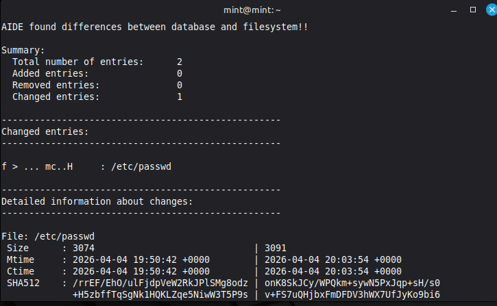

## Detection — File Integrity Monitoring (AIDE)

### Objective

The purpose of this component is to detect unauthorized modifications to critical system files.

File Integrity Monitoring (FIM) ensures that changes to sensitive files are identified and reported.

---

### Tool Used

- AIDE (Advanced Intrusion Detection Environment)

---

### Step 1 — Install AIDE

sudo apt update  
sudo apt install aide -y  

---

### Step 2 — Initialize Baseline

sudo aideinit  

This creates a baseline database representing the current state of system files.

---

### Step 3 — Simulate File Tampering

Modify a critical system file:

echo "malicious change" >> /etc/passwd  

---

### Step 4 — Run Integrity Check

sudo aide --check  

Expected result:

- Detection of file modification  
- Integrity violations reported  

Example output:

---

### Detection Behavior

AIDE compares the current system state against the baseline and reports:

- Modified files  
- Added files  
- Deleted files  

---

### Detection Summary

Detection Type        Method
--------------------  ----------------------------
File tampering        AIDE integrity check
Unauthorized changes  Baseline comparison

---

### Security Impact

Before implementation:

- No visibility into file modifications  
- No detection of system tampering  

After implementation:

- Unauthorized changes are detected  
- Critical system files are monitored  
- Integrity violations are reported  

---

### Outcome

File Integrity Monitoring enables detection of unauthorized system changes by:

- Establishing a trusted baseline  
- Monitoring file integrity  
- Reporting deviations from expected state  

This is critical for identifying system compromise and persistence techniques.
