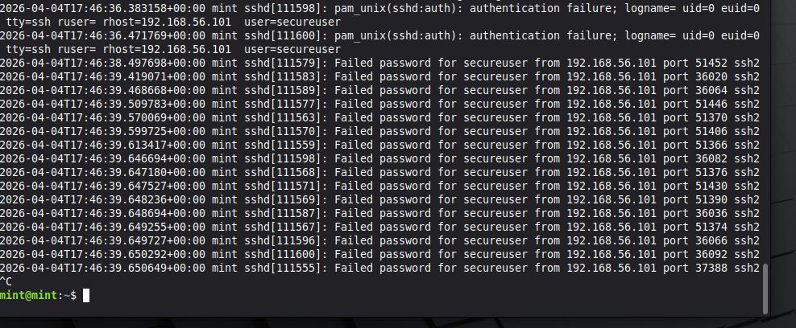
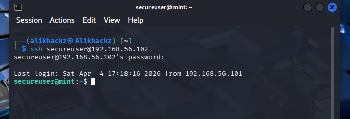

## Detection — Log Analysis (SSH Authentication)

### Objective

The purpose of this component is to detect malicious authentication activity by analyzing system logs.

This includes identifying brute-force attacks, tracking attacker behavior, and correlating login events.

---

### Log Source

Authentication activity is recorded in:

/var/log/auth.log  

---

### Step 1 — Monitor Logs in Real Time

sudo tail -f /var/log/auth.log  

This provides live visibility into authentication attempts.

---

### Step 2 — Identify Failed Login Attempts

Failed authentication attempts appear as:

Failed password for secureuser from <IP_ADDRESS>  

Key indicators of a brute-force attack:

- High frequency of failed login attempts  
- Repeated attempts from a single IP address  
- Sequential timestamps indicating automated behavior  

Example:

---

### Step 3 — Identify Successful Login Events

Successful authentication appears as:

Accepted password for secureuser from <IP_ADDRESS>  

This confirms valid access and may indicate compromise if unexpected.

Example:

---

### Step 4 — Correlate Attack Behavior

Using log data, attacker behavior can be reconstructed:

- Source IP address  
- Number of login attempts  
- Time-based attack patterns  
- Transition from failed to successful login (if applicable)  

---

### Detection Summary

Detection Type        Method
--------------------  ----------------------------
Brute-force attack    Log analysis (/var/log/auth.log)
Login success         Authentication log review
Source tracking       IP address correlation

---

### Security Impact

Before implementation:

- No visibility into authentication activity  
- No ability to identify brute-force attacks  

After implementation:

- Real-time monitoring of login attempts  
- Ability to detect automated attack patterns  
- Identification of attacker source IP  

---

### Outcome

Log analysis enables detection of malicious authentication behavior by:

- Monitoring login attempts  
- Identifying brute-force activity  
- Reconstructing attacker actions  

This forms the foundation for detection and response.
